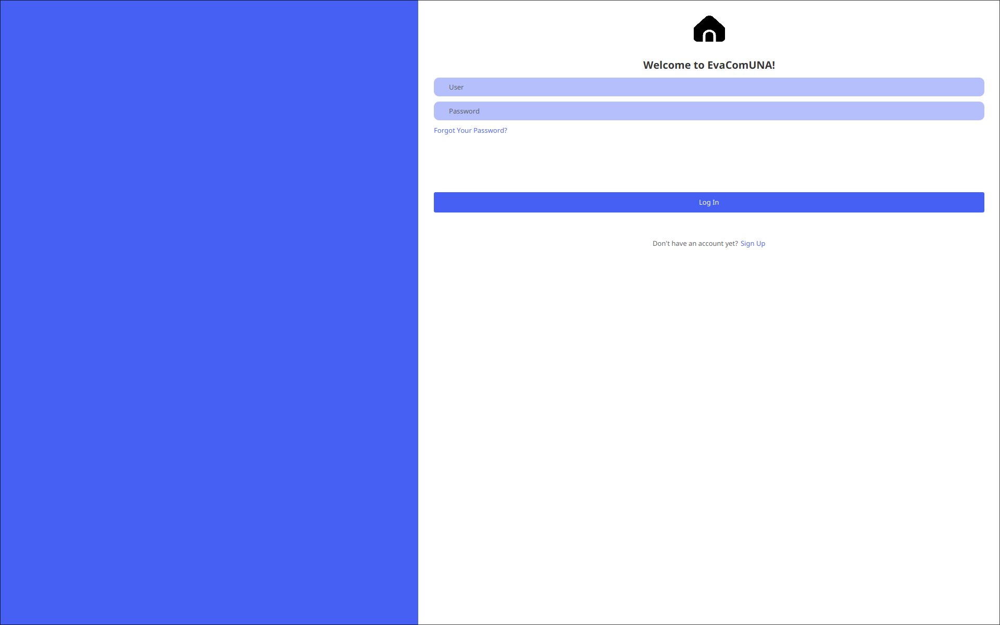
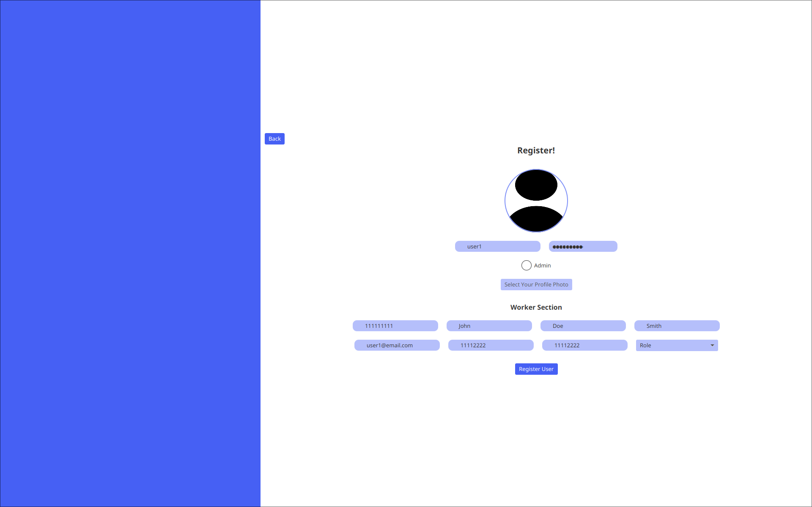
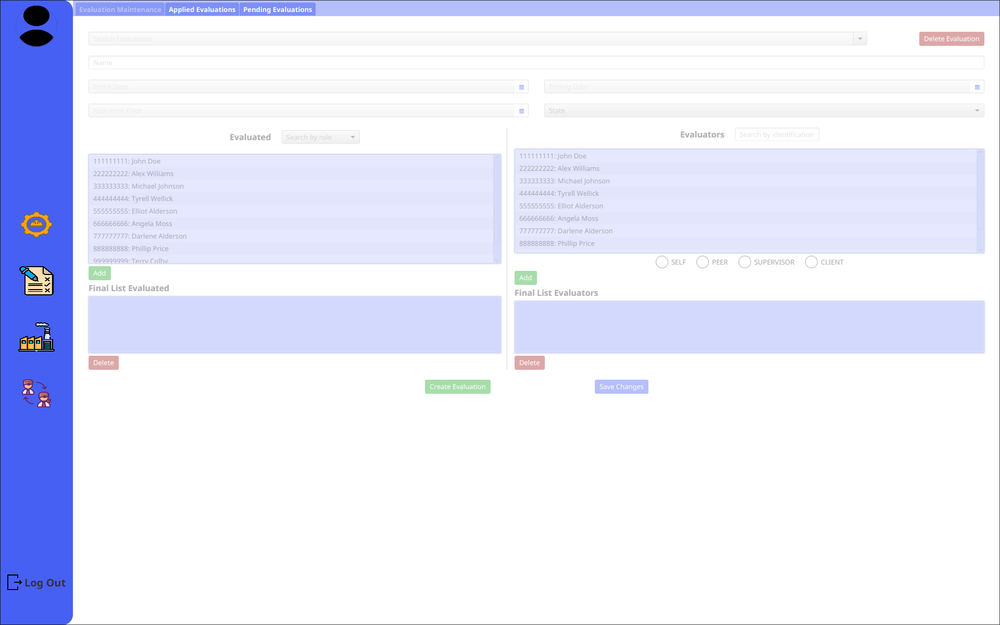
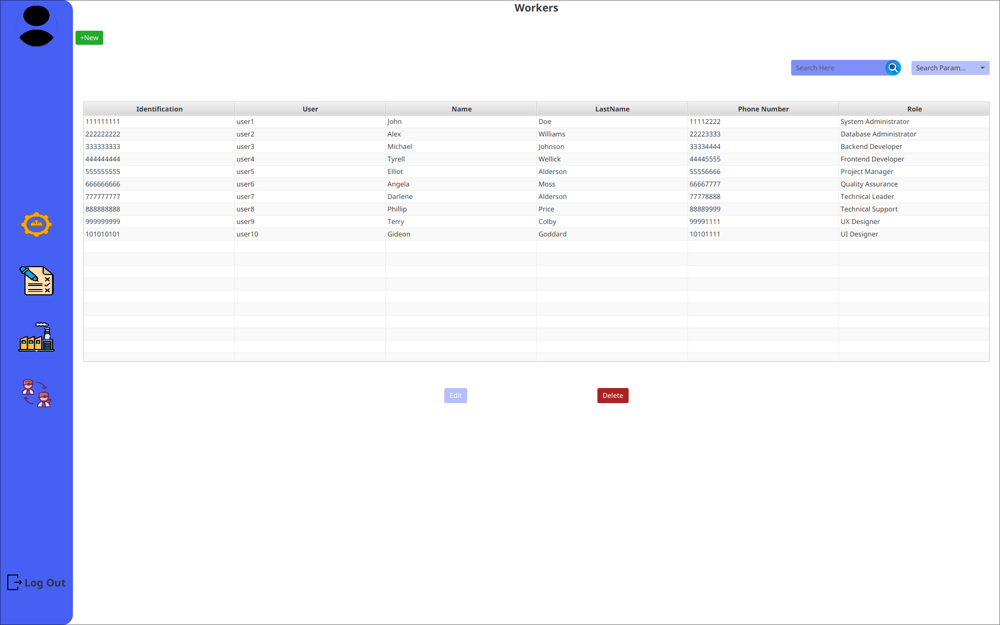

# tarea-programacion-iii-2023
¡Bienvenido al repositorio del proyecto de Programación III - EvaComUNA! En este proyecto, hemos desarrollado una aplicación web que ofrece funcionalidades para el registro de usuarios, mantenimiento de evaluaciones y trabajadores, y muchas más características útiles. A continuación, encontrarás información sobre cómo ejecutar el proyecto y las herramientas que hemos utilizado para su desarrollo. ¡Explora nuestras capturas de pantalla para obtener una vista previa de la aplicación!

## Capturas de Pantalla

### Inicio de sesión

*Captura de pantalla de la página de inicio de sesión, donde los usuarios pueden iniciar sesión en el sistema.*

### Registro de usuario

*Captura de pantalla de la página de registro de usuarios, donde nuevos usuarios pueden registrarse para obtener una cuenta.*

### Mantenimiento de evaluaciones

*Captura de pantalla de la página de mantenimiento de evaluaciones, donde los administradores pueden gestionar las evaluaciones.*

### Mantenimiento de trabajadores

*Captura de pantalla de la página de mantenimiento de trabajadores, donde los administradores pueden gestionar los perfiles de los trabajadores.*


## Tabla de Contenidos
- [tarea-programacion-iii-2023](#tarea-programacion-iii-2023)
  - [Capturas de Pantalla](#capturas-de-pantalla)
    - [Inicio de sesión](#inicio-de-sesión)
    - [Registro de usuario](#registro-de-usuario)
    - [Mantenimiento de evaluaciones](#mantenimiento-de-evaluaciones)
    - [Mantenimiento de trabajadores](#mantenimiento-de-trabajadores)
  - [Tabla de Contenidos](#tabla-de-contenidos)
  - [Clientes de la API SOAP evacomunaws](#clientes-de-la-api-soap-evacomunaws)
  - [Cómo ejecutar el proyecto cliente](#cómo-ejecutar-el-proyecto-cliente)
    - [Jar](#jar)
    - [Windows](#windows)
    - [Unix/Linux \& MacOS](#unixlinux--macos)
  - [Base de Datos](#base-de-datos)
    - [Aclaración para la ejecución de los scripts](#aclaración-para-la-ejecución-de-los-scripts)
    - [Script de creación de la base de datos](#script-de-creación-de-la-base-de-datos)
    - [Script para la generación del esquema de la base de datos](#script-para-la-generación-del-esquema-de-la-base-de-datos)
    - [Scripts para cargar datos de prueba](#scripts-para-cargar-datos-de-prueba)
    - [Scripts para los procedimientos almacenados](#scripts-para-los-procedimientos-almacenados)
    - [Scripts para las consultas](#scripts-para-las-consultas)
    - [Script del conjunto de datos](#script-del-conjunto-de-datos)
  - [Docker](#docker)
    - [Cómo levantar los contenedores](#cómo-levantar-los-contenedores)
    - [Oracle 21c XE Container](#oracle-21c-xe-container)
    - [Cómo levantar todos los contenedores del docker-compose](#cómo-levantar-todos-los-contenedores-del-docker-compose)
    - [Como detener los contenedores](#como-detener-los-contenedores)
    - [Como crear el esquema de la base de datos](#como-crear-el-esquema-de-la-base-de-datos)
  - [Git](#git)
    - [Convenciones](#convenciones)
    - [Commits](#commits)
    - [Ramas principales](#ramas-principales)
    - [Ramas temporales](#ramas-temporales)
    - [Merge Conflicts](#merge-conflicts)
  - [Payara Server](#payara-server)
    - [Cómo instalar Payara Server](#cómo-instalar-payara-server)
    - [Agregar Oracle JDBC Driver](#agregar-oracle-jdbc-driver)
    - [Cómo levantar Payara Server en Netbeans](#cómo-levantar-payara-server-en-netbeans)
    - [Cómo levantar Payara Server en modo debug](#cómo-levantar-payara-server-en-modo-debug)
    - [Cómo crear el JDBC Connection Pool](#cómo-crear-el-jdbc-connection-pool)
    - [Cómo crear el JDBC Resource](#cómo-crear-el-jdbc-resource)
    - [Cómo crear el JavaMail Session](#cómo-crear-el-javamail-session)
    - [Configuración de la sesión:](#configuración-de-la-sesión)
  - [Herramientas](#herramientas)

## Clientes de la API SOAP evacomunaws
Para probar el funcionamiento de la API SOAP, utilizamos tanto [Postman](https://www.postman.com/) como [SoapUI](https://www.soapui.org/).

## C&oacute;mo ejecutar el proyecto cliente

### Jar
El [Jar](evacomuna/evacomuna.jar) se encuentra en la carpeta `evacomuna/evacomuna.jar`.
Para ejecutar el jar, se crearon dos scripts, uno para Windows y otro para Unix/Linux & MacOS.

### Windows
En la carpeta ra&iacute;z del proyecto, ejecutar el siguiente comando:
```bat
evacomuna.bat
```

### Unix/Linux & MacOS
En la carpeta ra&iacute;z del proyecto, ejecutar el siguiente comando:
```bash
./evacomuna.sh
```

## Base de Datos 
La base de datos se encuentra en la carpeta [database](database/). Se debe de importar a la base de datos local, para poder probar el funcionamiento de la aplicaci&oacute;n. Se puede realizar por medio de contenedores de Docker o por medio de un cliente de Oracle.

### Aclaraci&oacute;n para la ejecuci&oacute;n de los scripts
Todos los scripts fueron creados para ser ejecutados en el cliente de [DBeaver](https://dbeaver.io/), por ende, se debe de cambiar el delimitador para su correcta ejecuci&oacute;n en el cliente de Oracle.

### Script de creaci&oacute;n de la base de datos
El [script](database/base.sql) de creaci&oacute;n de la base de datos se encuentra en la carpeta `database/base.sql`. 

### Script para la generaci&oacute;n del esquema de la base de datos
El [script](database/schema.sql) para la generaci&oacute;n del esquema de la base de datos se encuentra en la carpeta `database/schema.sql`.

### Scripts para cargar datos de prueba
Estos [scripts](database/loads/) encuentran en la carpeta `database/loads`. Son los mismos que se utilizaron para cargar el [dataset](database/dataset.sql).

### Scripts para los procedimientos almacenados
Estos [scripts](database/procedures/) encuentran en la carpeta `database/procedures`. Sirven para la activaci&oacute;n de usuario, para el cambio de contrase&ntilde;a y para la generaci&oacute;n de una nueva contrase&ntilde;a aleatoria.

### Scripts para las consultas
Estos [scripts](database/queries/) encuentran en la carpeta `database/queries`. Un par de consultas simples que se utilizaron para probar el funcionamiento de la base de datos.


### Script del conjunto de datos
Se cre&oacute; un [dataset](database/dataset.sql) de prueba, para poder probar el funcionamiento de la aplicaci&oacute;n. Este se debe
importar a la base de datos local, para poder probar el funcionamiento de la aplicaci&oacute;n. 

## Docker

### C&oacute;mo levantar los contenedores

### Oracle 21c XE Container
```docker
docker-compose start oracle 
```
&Uacute;nicamente se levantara el container de `oracle` 


### C&oacute;mo levantar todos los contenedores del docker-compose
```docker
docker-compose start
```

### Como detener los contenedores
```docker
docker-compose stop
```

### Como crear el esquema de la base de datos
```docker
docker exec oracle createAppUser EvaComUNA una 
```

Esencialmente se utilizaran las siguiente imagen:
- [Oracle 21c XE](https://hub.docker.com/r/gvenzl/oracle-xe)

## Git
Se estar&aacute; trabajando con un enfoque de ramas de corta y larga duraci&oacute;n. La primera para ramas temporales, que se vayan creando mientras se va desarrollando, la segunda para ramas principales.

### Convenciones


### Commits

Para el commit utilizaremos la siguiente convenci&oacute;n:
```
git commit -m "[<accion>] <seccion trabajada>" -m <mensaje breve/descriptivo>
```

Donde \<accion> puede ser:
- feat: Nueva funcionalidad
- fix: Correcci&oacute;n de errores
- add: Agregado de archivos
- remove: Eliminaci&oacute;n de archivos
- refactor: Refactorizaci&oacute;n de c&oacute;digo
- bug: Se introdujo un bug
- docs: Documentaci&oacute;n

Un ejemplo de un commit ser&iacute;a:
```
git commit -m "[feat] Login" -m "Se agrego la funcionalidad de login"
```

De esta manera cuando se verifique el log, se podr&aacute; ver de manera m&aacute;s clara que se hizo en cada commit.

### Ramas principales
Para las ramas de larga duraci&oacute;n, se utilizar&aacute; la siguiente convenci&oacute;n:
- master

La rama master ser&aacute; la rama principal, cualquier cambio que se agregue a esta rama, debe de ser aprobado por los dem&aacute;s miembros del equipo. Solo se debe de hacer merge a esta rama cuando se tenga una versi&oacute;n estable del proyecto.

- dev

La rama dev ser&aacute; la rama de desarrollo, se implementan las nuevas funcionalidades en esta rama. Cuando se tenga una versi&oacute;n estable, se hace merge a la rama master.

- test

La rama test ser&aacute; la rama de pruebas, se prueba el funcionamiento del c&oacute;digo en esta rama. Utilizando JUnit5 como framework de pruebas. 

### Ramas temporales
Para las ramas de corta duraci&oacute;n, se utilizar&aacute; la siguiente convenci&oacute;n:

- feature/\<nombre>

### Merge Conflicts
Para los merge coflicts, deben de estar al menos 2 personas presentes para resolverlos. Preferiblemente, se debe de resolver en conjunto con la persona que hizo el commit.

## Payara Server
### C&oacute;mo instalar Payara Server
Para instalar Payara Server, se debe de descargar el archivo zip de la p&aacute;gina oficial de [Payara](https://www.payara.fish/). Una vez descargado, se debe de descomprimir el archivo en la carpeta deseada.

### Agregar Oracle JDBC Driver
Para agregar el driver de Oracle, se debe descargar el archivo [ojdbc11.jar](https://download.oracle.com/otn-pub/otn_software/jdbc/233/ojdbc11.jar), a la carpeta `payara/glassfish/domains/domain1/lib/`. Una vez agregado, se debe de reiniciar el servidor.

### C&oacute;mo levantar Payara Server en Netbeans
Para levantar Payara Server en Netbeans, se debe de ir a la pesta&ntilde;a de `Services`, en la secci&oacute;n de `Servers`, dar click derecho, agregar servidor, seleccionar Payara Server, y seleccionar la carpeta donde se instal&oacute; Payara Server.

Luego, se debe de ir a la pesta&ntilde;a de `Services`, en la secci&oacute;n de `Servers`, dar click derecho, y seleccionar `Start`.

### C&oacute;mo levantar Payara Server en modo debug
Para levantar Payara Server en modo debug, se debe de ir a la pesta&ntilde;a de `Services`, en la secci&oacute;n de `Servers`, dar click derecho, y seleccionar `Start in debug mode`.

### C&oacute;mo crear el JDBC Connection Pool
Para crear el JDBC Connection Pool, se debe de ir a la pesta&ntilde;a de `Services`, en la secci&oacute;n de `Servers`, dar click derecho, y seleccionar `View Admin Console`. Una vez en la consola de administraci&oacute;n, se debe de ir a la secci&oacute;n de `Resources`, y seleccionar `JDBC`, luego seleccionar `JDBC Connection Pools`, y dar click en `New`.

En la secci&oacute;n de `General Settings`, se debe de agregar el nombre del pool `EvaComPool`, y seleccionar el recurso de tipo `javax.sql.PoolConnectionDataSource`. Luego dar click en `Next`.

En la secci&oacute;n de `Additional Properties`, se debe de dejar solo tres propiedades:
- User: `EvaComUNA` 
- Password: `una`
- URL: `jdbc:oracle:thin:@localhost:1521/XEPDB1`

Luego dar click en `Finish`.

En general, volver y probar donde dice `Ping`, para verificar que el pool se haya creado correctamente.

### C&oacute;mo crear el JDBC Resource
Para crear el JDBC Resource, se debe de ir a la pesta&ntilde;a de `Services`, en la secci&oacute;n de `Servers`, dar click derecho, y seleccionar `View Admin Console`. Una vez en la consola de administraci&oacute;n, se debe de ir a la secci&oacute;n de `Resources`, y seleccionar `JDBC`, luego seleccionar `JDBC Resources`, y dar click en `New`.

En la secci&oacute;n de `General Settings`, se debe de agregar el nombre del recurso `jdbc/EvaCom`, y seleccionar el pool creado anteriormente. Luego dar click en `OK`.

### C&oacute;mo crear el JavaMail Session
Para crear el JavaMail Session, se debe de ir a la pesta&ntilde;a de `Services`, en la secci&oacute;n de `Servers`, dar click derecho, y seleccionar `View Admin Console`. Una vez en la consola de administraci&oacute;n, se debe de ir a la secci&oacute;n de `Resources`, y seleccionar `JavaMail Sessions`, y dar click en `New`.

En la secci&oacute;n de `General Settings`, se debe de agregar el nombre de la sesi&oacute;n `mail/EvaComMailSession`, y seleccionar el pool creado anteriormente. Luego dar click en `OK`.

### Configuraci&oacute;n de la sesi&oacute;n:
- Mail Host: `smtp.gmail.com`
- Default User: `evacomuna@gmail.com`
- Password: `abfbwxahufegmtyz`
- Auth: `true`
- Default Sender Address: `evacomuna@gmail.com`
- mail.smtp.starttls.required: `true`
- mail.smtp.starttls.enable: `true`
- mail.smtp.port: `587`


## Herramientas
- [Git](https://git-scm.com/)
- [Docker](https://www.docker.com/)
- [Postman](https://www.postman.com/)
- [SoapUI](https://www.soapui.org/)
- [DBeaver](https://dbeaver.io/)
- [Oracle Database 21c XE](https://www.oracle.com/database/technologies/xe-downloads.html)
- [Oracle Database 21c XE Docker Image](https://hub.docker.com/r/gvenzl/oracle-xe)
- [Payara Server](https://www.payara.fish/)
- [Payara Server Docker Image](https://hub.docker.com/r/payara/server-full)
- [Trello](https://trello.com/)
